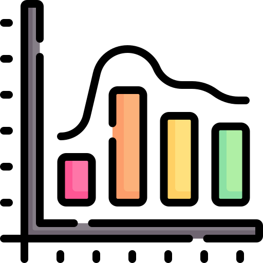
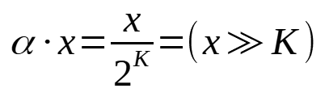
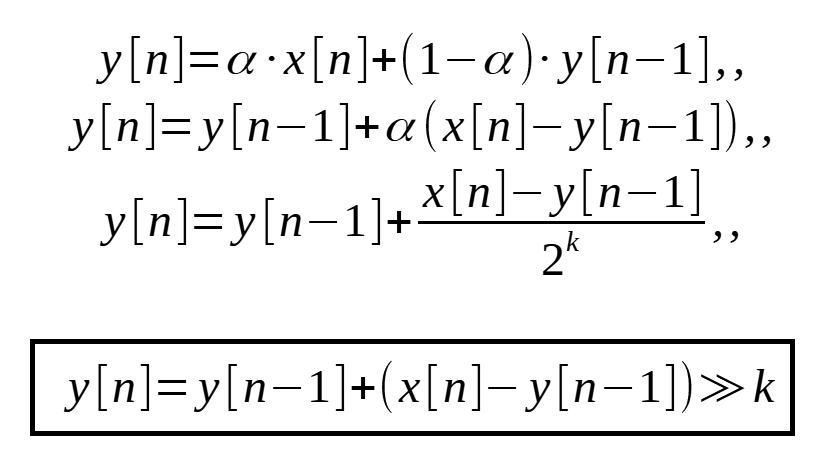
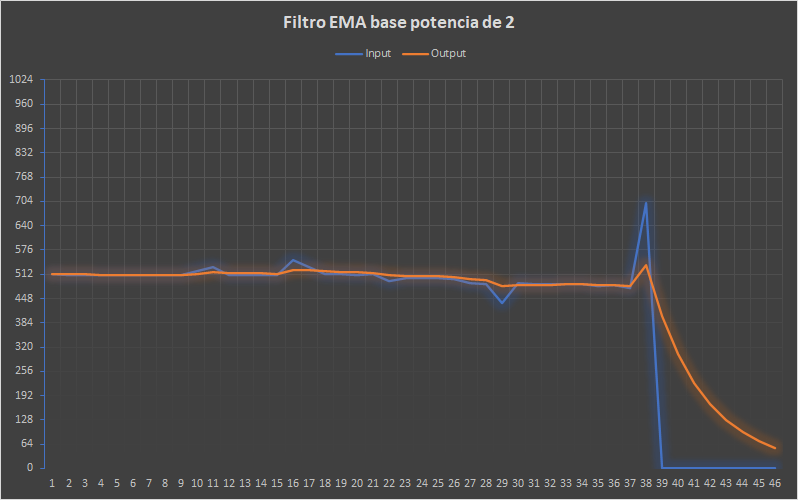

# EMA #

[](README.md)
[]()

Arduino library for Exponential Moving Average filter (EMA), implemented very easily and efficiently.

## Information ##

The EMA (exponential moving average) or EWMA (exponentially weighed moving average) is the name for what is probably the easiest realization of the (first-order) low-pass on discrete time-domain data. 
```C++
Y[n] = alpha * X[n] + (1 - alpha) * Y[n-1]
```
A moving average is commonly used with time series data to smooth out short-term fluctuations and highlight longer-term trends or cycles. When AVR,s (as Arduino) get the value from ADC port, it can get small fluctuations in the measure. 

The factor `alpha` in the difference equation of the Exponential Moving Average filter is a number between zero and one. There are two main ways to implement this multiplication by `alpha`: Either we use floating point numbers and calculate the multiplication directly, or we use integers, and express the multiplication as a division by `1/alpha > 1`.

Both floating point multiplication and integer division are relatively expensive operations, especially on embedded devices or microcontrollers.

We can, however, choose the value for `alpha` in such a way that `1/alpha = 2^K`.

This is useful, because a division by a power of two can be replaced by a very fast right bitshift:
<p align=center>

</p>
We can now rewrite the difference equation of the EMA with this optimization in mind:
<p align=center>

</p>

## Graphic example ##

In this graphics shows an EMA filter (K=2) using values from an analog port on Arduino Uno.
<p align=center>

</p>

## Installation ##

### Arduino IDE ###

For a tutorial on how to install new libraries for use with the Arduino
development environment please refer to the following website:
http://www.arduino.cc/en/Reference/Libraries

--- or ---

1. Download the ZIP file from the page [releases](https://github.com/RafaelReyesCarmona/ACS712_Hall/releases) to your machine.
<p align=center>

</p>

2. In the Arduino IDE, choose Sketch/Include Library/Add Zip Library.
<p align=center>

</p>

3. Navigate to the ZIP file, and click Open.

### PlatformIO ###

How to use the library in PlatformIO see [documentation](https://docs.platformio.org/en/latest/librarymanager/index.html) of Library Manager.

The only one simple step is to define dependencies in “platformio.ini” (Project Configuration File). For example,

```
# platformio.ini – project configuration file

[env:my_build_env]
platform = atmelavr
framework = arduino
lib_deps =
  # RECOMMENDED
  # Accept new functionality in a backwards compatible manner and patches
  rafaelreyescarmona/EMA @ ^0.1.1

  # Accept only backwards compatible bug fixes
  # (any version with the same major and minor versions, and an equal or greater patch version)
  rafaelreyescarmona/EMA @ ~0.1.1

  # The exact version
  rafaelreyescarmona/EMA @ 0.1.1
```

For Manual installation in PlatformIO Core:

1. Run a terminal and type for search the library: 
```
pio lib search EMA
```
<p align=center>

</p>

2. Type for install:
```
pio lib install 13380
```

--- or ---

1. Search "EMA" in search box of _Libraries_ of panel.
<p align=center>

</p>

2. Click _Add to project_ button. Library will be included in the project and "platformio.ini" updated.
<p align=center>

</p>

## How to use the library ##

In Arduino IDE, Choose Sketch/Include Library/Scroll and select "EMA".
<p align=center>

</p>

There are a two examples files with the library. In the Arduino IDE, choose File/Examples/EMA, and you can see "EMA".

<p align=center>

</p>

--- or ---

Example of use:

```C++
/**
 * Example sketch for the EMA library.
 */

 #include <Arduino.h>
 #include <EMA.h>

 #define PIN_READ A0

void setup() {
    pinmode(PIN_READ, INPUT);

}

void loop(){
    uint16_t read;
    uint16_t read_filtered;
    static EMA<2> EMA_filter(250);  // Initial value for EMA filter.

    read = analogRead(PIN_READ);
    read_filtered = EMA_filter(read);

    Serial.print("Read from ADC : ");
    Serial.print(read);
    Serial.print(" , Filtered value: ");
    Serial.print(read_filtered);
    Serial.print("\n");

    delay(250);
}
```
### Filtering the result of `analogRead` ###

On AVR,s (as ATMega328) `analogRead` returns an integer between 0 and 1023, which can be represented using 10 bits, so `Resolution = 10`. Input is `uint16_t` so the maximum shift factor `K` is `16 - Resolution = 6`.

If `analogRead` retunrs an 12 bits integer (an integer between 0 and 4095), the maximum shift factor `K` will be `16 - 12 = 4`. 

## Changelog ##

### V0.1.1

  * Initialize filter to zero or optional given value.

### V0.1
  * Initial version.
## License ##

This file is part of EMA Library.

EMA Library is free software: you can redistribute it and/or modify it under the terms of the GNU General Public License as published by the Free Software Foundation, either version 3 of the License, or (at your option) any later version.

EMA Library is distributed in the hope that it will be useful, but WITHOUT ANY WARRANTY; without even the implied warranty of MERCHANTABILITY or FITNESS FOR A PARTICULAR PURPOSE.  See the GNU General Public License for more details.

You should have received a copy of the GNU General Public License along with EMA Library.  If not, see <https://www.gnu.org/licenses/>.

[](LICENSE)

## Authors ##

Copyright © 2022 Francisco Rafael Reyes Carmona.
Contact me: rafael.reyes.carmona@gmail.com

## Credits ##

Electric meter icon at the beginning is from [Flaticon.es](https://www.flaticon.es) designed by [Freepik](https://www.flaticon.com/authors/freepik)
and licensed by [free license](img/license.pdf).
